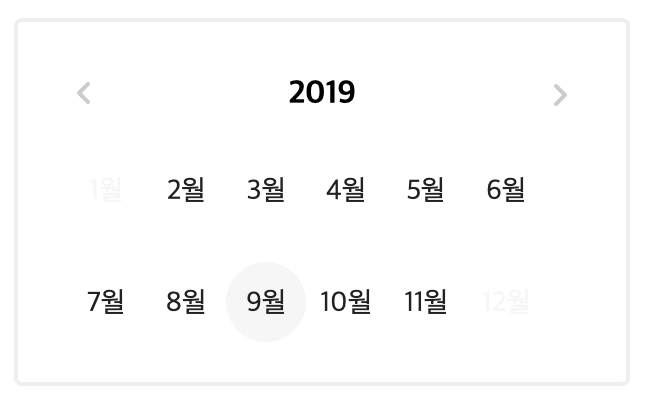
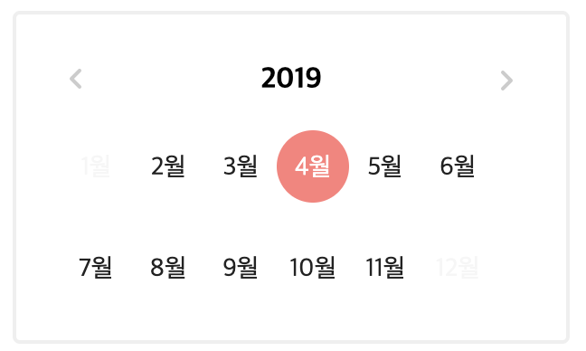

# deali-month-picker

### dealicious 를 위한 컴포넌트
> Supports Vue 2.x <br>
> Test Version is 0.1.x

### Imgs
#### Hover
<br>
#### Click


##Usage
```bash
props:{
    minDate: {
      type: Date
    },
    maxDate: {
      type: Date
    }
}
```

### minDate, maxDate 값은 : Date 객체

```bash
<template>
    <div>
         <deali-month :minDate="minDate" :maxDate="maxDate" @clickDate="getDate"></deali-month>
    </div>
</template>

<script>
    import dealiMonth from 'deali-month-picker';


    export default {
        components:{
            dealiMonth
        },
        data(){
          return{
              minDate:  new Date('2019-01'),
              nowDate : new Date(),
          }
        },
        methods:{
            getDate(payload){
                console.log(payload);
            }
        }

    }
</script>
```

